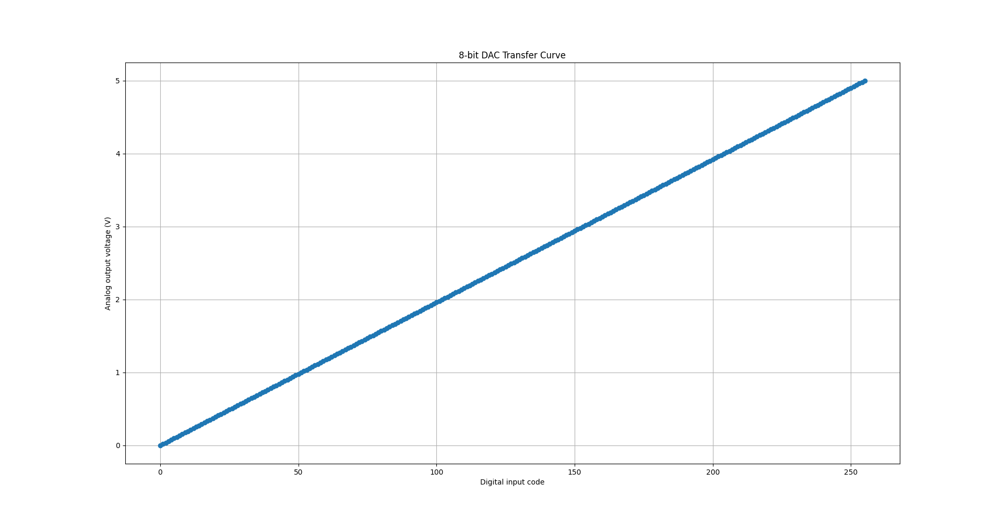

# 8-bit Digital To Analog Converter (DAC) Behavioral Model 

This Project implements and verifies a **behavioral 8-bit Digital to Analog Converter** using **SystemVerilog** for digital modeling and **Python** for post-simulation verification.

---

## Concept 

A **DAC** Converts a digital binary input code into an analog voltage output/
For an 8-bit DAC, the conversion equation is

Vout = Vref * (D/255)

where,

- `D` = 8-bit digital input (`0-255`)
- `Vref` = reference voltage (eg, `1.2` to `5.0`)
- `Vout` = analog output voltage

This model is purely **behavioral**. not transistor-level. It demonstrates the mapping from digital to analog domains in **mixed-signalverification context**.

---

## Requirements

### Simulation Tools
- [Icarus Verilog](https://steveicarus.github.io/iverilog/) — for SystemVerilog simulation  
- Python 3.x with:
  - `numpy`
  - `matplotlib`
  - `csv`

Install Python libraries (if needed):

```
pip install numpy matplotlib
```

--- 

## How to run

Clone this repo first:

```
git clone https://github.com/krushangptl/DAC_8_bits
cd DAC_8_bits
```

Run the followings:

```
iverilog -g2012 -o output/dac8bit src/dac8bit.sv tb/testbench.sv
vvp output/dac8bit
```

Verify and Plot using Python:

```
python3 script.py
```

--- 

## Example Output Plot

Here is the Example of the **DAC Transfer Curve** produced by the project.



### Verification Summary

| Metric                          | Description                       | Expected                            |
| ------------------------------- | --------------------------------- | ----------------------------------- |
| **LSB (Least Significant Bit)** | Voltage step per code             | `Vref / 255 = 5.0 / 255 ≈ 19.61 mV` |
| **Monotonicity**                | Output always increases with code | Yes                               |
| **Linearity**                   | Output follows straight line      | Ideal behavioral linearity        |


From Verilog Testbench:

- Vout_min = 0 V
- Vout_max = 4.8 V 
- LSB = 0.0196 V (approax)

--- 

by Krushang Patel

